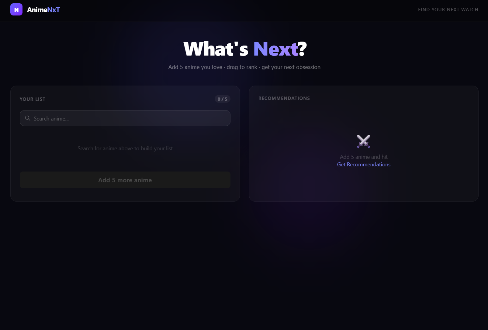

# AnimeNxT
Helps you find what anime to watch next


# AnimeNxT

> Personalized anime recommendations powered by a custom scoring algorithm and the AniList GraphQL API.



**[Live Demo](https://animenxt.vercel.app)** · **[GitHub](https://github.com/cfdoud/AnimeNxT)**

---

## Overview

AnimeNxT helps you find your next anime by learning from what you already love. Pick 5 anime, rank them by preference, and a custom weighted similarity algorithm scores hundreds of candidates to surface the best matches for your taste.

The results come back as an interactive deck — slash what you don't want, heart what you do, and purge the rest to get a fresh scored batch. The deck never repeats anime you've already seen.

---

## Features

- **Live Search** — Debounced search against the AniList GraphQL API with cover images and genres shown inline
- **Drag to Rank** — Reorder your 5 picks by dragging. Position maps directly to algorithm weight — #1 influences results the most
- **Custom Recommendation Algorithm** — Scores candidates using weighted Jaccard similarity, a taste profile, community score, and a popularity penalty
- **Infinite Deck** — Slash or purge anime and seamlessly get a fresh scored batch without ever repeating a result
- **Slash Animation** — A red slash line sweeps across a card before it exits when you reject it
- **Candidate Pool Caching** — AniList is queried once per session; all subsequent batches are scored locally

---

## Tech Stack

| | |
|---|---|
| **Frontend** | React 18, TypeScript |
| **Build** | Vite |
| **Styling** | Tailwind CSS |
| **Drag & Drop** | @dnd-kit |
| **Routing** | React Router |
| **API** | AniList GraphQL |
| **Deployment** | Vercel |

---

## How the Algorithm Works

The recommender builds a **taste profile** from your 5 ranked favorites and scores every anime in the candidate pool across four components:

| Component | Weight | Description |
|---|---|---|
| Favorite Similarity | 45% | Weighted Jaccard similarity across genres and tags vs your 5 picks |
| Taste Profile Match | 25% | Match against a normalized preference vector built from your favorites |
| AniList Average Score | 10% | Normalized community rating |
| Popularity Penalty | 5% | Small negative weight for very popular titles to surface hidden gems |

Rank weights applied to favorites: `#1 = 1.0` · `#2 = 0.8` · `#3 = 0.6` · `#4 = 0.4` · `#5 = 0.2`

Jaccard similarity measures genre/tag overlap between two anime:

```
jaccard(A, B) = |A ∩ B| / |A ∪ B|
```

Candidates are pre-filtered to remove your favorites, sequels, and mid-series entries before scoring.

---

## Getting Started

```bash
git clone https://github.com/cfdoud/AnimeNxT.git
cd AnimeNxT
npm install
npm run dev
```

Open [http://localhost:5173](http://localhost:5173)

---

## How to Use

1. **Search** for anime you've watched and loved
2. **Add 5** to your list — the counter tracks your progress
3. **Drag to rank** from most loved (#1) to least (#5)
4. **Hit Get Recommendations** to run the algorithm
5. **Heart** anime to save, **slash** to remove
6. **Send to Filler Hell** to purge non-favorites and load a fresh batch

---

## Project Structure

```
src/
├── api/
│   └── anilist.ts        # GraphQL queries, search, candidate pool fetch
├── components/
│   ├── AnimeInput.tsx    # Debounced live search with dropdown suggestions
│   ├── AnimeList.tsx     # Drag-to-rank list using @dnd-kit
│   └── Results.tsx       # Infinite recommendation deck with slash animation
├── pages/
│   └── home.tsx          # Main page, state orchestration, algorithm wiring
├── utils/
│   └── recommender.ts    # Scoring algorithm, taste profile, Jaccard similarity
└── types.ts              # Shared TypeScript types
```

---

## Technical Highlights

**Stale closure handling** — Async functions in React capture state at creation time. When the deck exhausts and fetches a new batch mid-interaction, naive `useState` returns stale values. All mutable values read inside async functions are stored in `useRef` to guarantee async functions always access current data.

**Candidate pool caching** — The AniList pool is fetched once and cached in state. Subsequent batches are scored locally by filtering the cached pool with a growing `seenIds` Set, eliminating redundant API calls and guaranteeing no repeated results.

**Debounced search** — A custom `useDebounce` hook delays API calls by 300ms while typing, preventing rate limiting on the AniList endpoint.

---

## Acknowledgements

- [AniList](https://anilist.co) for their free GraphQL API
- [@dnd-kit](https://dndkit.com) for drag and drop primitives
